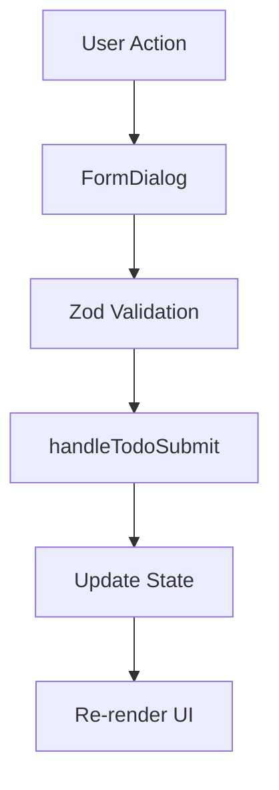

## Overview

The Todo List application is built with a modern React architecture using TypeScript for type safety, Vite for build tooling, and Material-UI for the component library. The application follows a component-based architecture with clear separation of concerns.

## Technology stack

The application leverages the following key technologies:

<CodeGroup>

```json package.json
{
  "dependencies": {
    "@emotion/react": "^11.14.0",
    "@emotion/styled": "^11.14.1",
    "@mui/material": "^7.3.5",
    "react": "^19.2.0",
    "react-dom": "^19.2.0",
    "zod": "^4.1.13"
  }
}
```

</CodeGroup>

### Core dependencies

- **React 19**: Latest version of React for UI components
- **TypeScript 5.9**: Type-safe development
- **Vite 7**: Fast build tool and development server
- **Material-UI 7**: Component library with Emotion for styling
- **Zod 4**: Schema validation and type inference

## Project structure

The source code is organized as follows:

```text
src/
├── App.tsx              # Main application component
├── FormDialog.tsx       # Dialog component for adding/editing todos
├── main.tsx            # Application entry point
├── types/
│   └── todo.ts         # Todo type definition and Zod schema
├── App.css             # Component-specific styles
└── index.css           # Global styles
```

## Application architecture

### Entry point

The application bootstraps in `src/main.tsx:6-10`:

```tsx main.tsx
import { StrictMode } from 'react'
import { createRoot } from 'react-dom/client'
import './index.css'
import App from './App.tsx'

createRoot(document.getElementById('root')!).render(
  <StrictMode>
    <App />
  </StrictMode>,
)
```

<Note>
The app uses React 19's `createRoot` API and runs in `StrictMode` for additional development checks.
</Note>

### State management

The application uses React's built-in state management with hooks:

```tsx App.tsx
const [todoList, setTodoList] = useState<Set<Todo>>(new Set());
const [search, setSearch] = useState("");
const [debouncedSearch, setDebouncedSearch] = useState("");
const [isDialogOpen, setIsDialogOpen] = useState(false);
const [editingTodo, setEditingTodo] = useState<Todo | null>(null);
```

#### Key design decisions

**Using Set for todos**: The application stores todos in a `Set<Todo>` rather than an array:
- Prevents duplicate todos naturally
- Enables efficient add/delete operations
- Requires converting to array for rendering: `Array.from(todoList)`

**Debounced search**: Search input is debounced with a 300ms delay to optimize performance:

```tsx App.tsx
useEffect(() => {
  const timeoutId = setTimeout(() => {
    setDebouncedSearch(search.trim().toLowerCase());
  }, 300);

  return () => clearTimeout(timeoutId);
}, [search]);
```

### Core functionality

#### Adding and editing todos

The `handleTodoSubmit` function handles both creating new todos and updating existing ones:

```tsx App.tsx
const handleTodoSubmit = (todo: Todo) => {
  setTodoList((prevTodoList) => {
    const next = new Set(prevTodoList);
    if (editingTodo) next.delete(editingTodo);
    
    next.add({...todo, completed: editingTodo?.completed ?? false});
    return next;
  });
  setIsDialogOpen(false);
  setEditingTodo(null);
};
```

<Info>
When editing, the function preserves the todo's completion status by using the existing `completed` value or defaulting to `false` for new todos.
</Info>

#### Toggling completion

```tsx App.tsx
const toggleComplete = (todo: Todo) => {
  setTodoList((prevTodoList) => {
    const next = new Set(prevTodoList);
    next.delete(todo);
    next.add({ ...todo, completed: !todo.completed });
    return next;
  });
};
```

#### Deleting todos

```tsx App.tsx
const deleteTodo = (todo: Todo) => {
  setTodoList((prevTodoList) => {
    const next = new Set(prevTodoList);
    next.delete(todo);
    return next;
  });
};
```

#### Filtering todos

Filtering uses the debounced search value for case-insensitive name matching:

```tsx App.tsx
const filteredTodos = Array.from(todoList).filter((todo) => {
  if (!debouncedSearch) return true;
  return todo.name.toLowerCase().includes(debouncedSearch);
});
```

## Data flow

1. **User interaction**: User clicks "Add Todo" or "Edit" button
2. **Dialog opens**: `FormDialog` component receives `onSubmit` callback and `initialTodo` (for edits)
3. **Form submission**: User fills form, Zod validates input
4. **State update**: Validated todo is passed to `handleTodoSubmit`
5. **Re-render**: Component re-renders with updated todo list



## Performance considerations

- **Debounced search**: 300ms debounce prevents excessive filtering operations
- **Immutable updates**: State updates create new Set instances for predictable React re-renders
- **Component separation**: Form logic isolated in `FormDialog` to prevent unnecessary App re-renders

## Type safety

The entire application is built with TypeScript, providing:
- Compile-time type checking
- IntelliSense in IDEs
- Runtime validation through Zod schemas
- Type inference from Zod schemas using `z.infer<typeof todoSchema>`